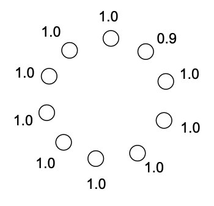
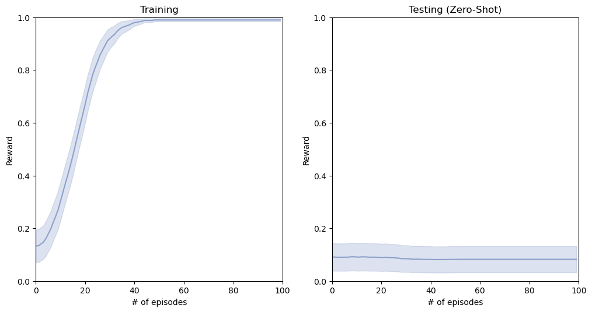
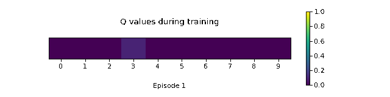
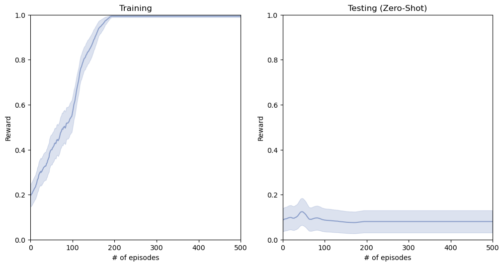
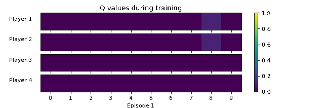
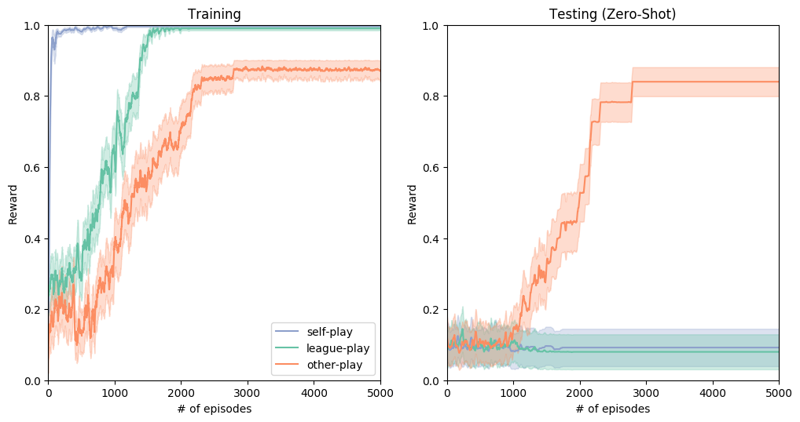
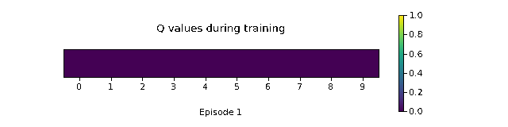

### Summary
>This repository implements the "Lever Coordination Game" from [Hu, Hengyuan, et al. (2020)](https://arxiv.org/pdf/2003.02979.pdf) and shows that the *other->play* learning algorithm outperforms basic self-play and league-play agents in the *zero-shot coordination* scenario. 

# The Lever Coordination Game
The lever coordination game is a simple two player cooperative game involving levers.  
The game is played for only a single round and the goal is for two players to select the same lever.  
If two players select the same lever, they receive a reward equal to the pay-off associated with that lever.  
Otherwise, their reward is zero.  

In this repository, the following version of the game is played: there are nine levers with payoff 1, and one lever with payoff 0.9  

  

# Zero-Shot Coordination
The lever coordination game was designed to illustrate the pitfalls of the *zero-shot coordination* scenario for multi-agent problems.  
In zero-shot coordination, agents are placed in a situation in which they have to cooperate with novel partners they have not encountered during training. In other words, they must play with strangers.  

Adding to the difficulty of this, zero-shot coordination assumes it is not possible to communicate or coordinate with your partner beforehand. 

So, our goal for the lever coordination game will be to train a single agent who will be able to play with novel partners without being able to coordinate on a strategy. 

## Self-Play
A common learning strategy for multi-agent problems is the *self-play* algorithm. 
In self-play, a single agent is trained by playing the multi-agent game with clones of itself. 
Self-play agents can be very succesful in finding nash equilibria in competetive zero-sum games.
Self-play agents even tend to find 'inhuman' strategies in complex games ([Carroll et all. (2020)](https://arxiv.org/pdf/1910.05789.pdf)). 
This is great in competitive games in which you have to beat your opponent. However, this is perhaps impractical in cooperative games in which you have to work with your partner, rather than beat it. 

Let's see how a basic self-play agent performs in the lever coordination game.  

  

The self-play agent performs well during training, but underperforms in the zero-shot coordination setting.

---
Let's visualise the agent's Q values during training to get a better understanding of what it is learning.  

  

The self-play agent learns to play one of the levers with payoff 1.
This is great during training when it is playing with a clone of itself.
The clone will always pick the same lever and the 1 payoff is gauranteed. 

However, this is not a great strategy for zero-shot coordination.
There is no way to coordinate with the novel partner *which* of the levers with payoff 1 to select.
Every self-play agent trained with a different random seed will settle on a different payoff 1 lever.
The average return in zero-shot coordination for this strategy is therefore 1/9 = 0.11.

## League-Play
A more sophisticated learning strategy similar to self-play is *league-play*. 
Rather than training a single agent by playing with itself, league-play simultaneously trains a league of multiple agents by training with each other. 

Let's see how a league of 4 players performs in the lever game.  

  

Similar to the self-play agent, the league-play agents performs well during training but underperform during testing.

---
Let's visualise the agents Q values during training to get a better understanding of what it is learning.  

  

Similar to the self-play agent, the league-play agents all eventualy settle on a payoff 1 lever to select.
This strategy has the same issues as the self-play agent's strategy and therefore performs very poorly in zero shot coordination.

*Note that the league play agents require more training steps to converge. This is due to the added stochasticity in the form of multiple independent agent strategies during training*

## Other-Play
The definition of the lever coordination game does not contain any labels for the levers in question.
Because of this the game admits a set of symmetries: an arbitrary relabeling of payoff-equivalent levers will not change any outcome of the game (up to relabeling).

The self-play/league-play agents perform admirably during training because they can coordinate on which of the 9 levers with payoff 1 to select. 
In effect, they can coordinate on how to break the symmetry of the game.
However, in zero-shot coordination this coordinated symmetry breaking is not possible.

In [Hu, Hengyuan, et al. (2020)](https://arxiv.org/pdf/2003.02979.pdf), they propose the *other-play* learning rule for zero-shot coordination. 
In other-play, agents are forced to train with players that are continually breaking these symmetries in an arbitrary way. 
By doing this, it aims to build agents that are robust to this arbitrary symmetry breaking phenomenon.

In our lever game, this is implemented by randomly relabeling the levers, at every training step, for every agent. 
This way all agents play in their own randomly relabeled version of the game.

Let's see how well this agent performs in the lever game.  

  

The other-play agent performs slightly worse than the self-play and league-play agents during training, but performs much better during testing.
Moreover, the performance of the other-play agent during training and testing is very similar. 
This suggests the other-play agent has found a strategy that works even when playing with novel partners. 

---
Let's visualise the other-play agent's Q values during training to get a better understanding of what it is learning.  

  

The other-play agent's strategy is to select the lever with a 0.9 payoff. 
Even though this is the lever with lowest payoff, it is the only lever with a unique payoff. 
For this reason, every agent trained with the other-play learning algorithm, regardless of its initial random seed, will select the same 0.9 payoff lever. 
This strategy is therefore robust to the zero-shot coordination setting. 

*Note  that the other-play algorithm requires even more training steps to converge. This is due to the added stochasticity of randomly relabeling the nodes during every training step.*

